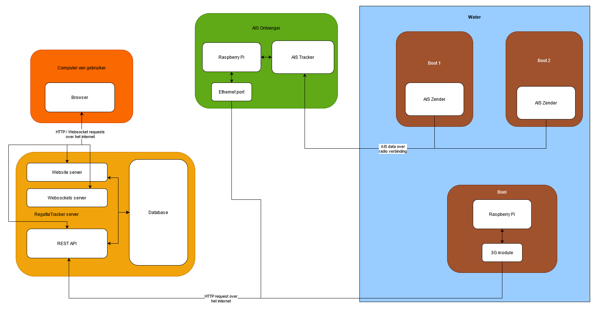

[&laquo; Back to the README.md](../README.md)

# Communicatie Documentatie
In dit diagram staan alle verschillende gedeeltes van het RegattaTracker systeem weergeven en de communicatie stromen die daar tussen plaats vinden:

Boten zenden dus AIS informatie uit die wordt ontvangen door de AIS receiver die die informatie dan weer doorverstuurd naar de REST API. De boei module stuurt ook via de REST API zijn locatie gegevens door.

Verschillende browsers / de Android App verbinden dan met de website en de websockets server die zo alle informatie kunnen inlezen en kunnen aanpassen.
